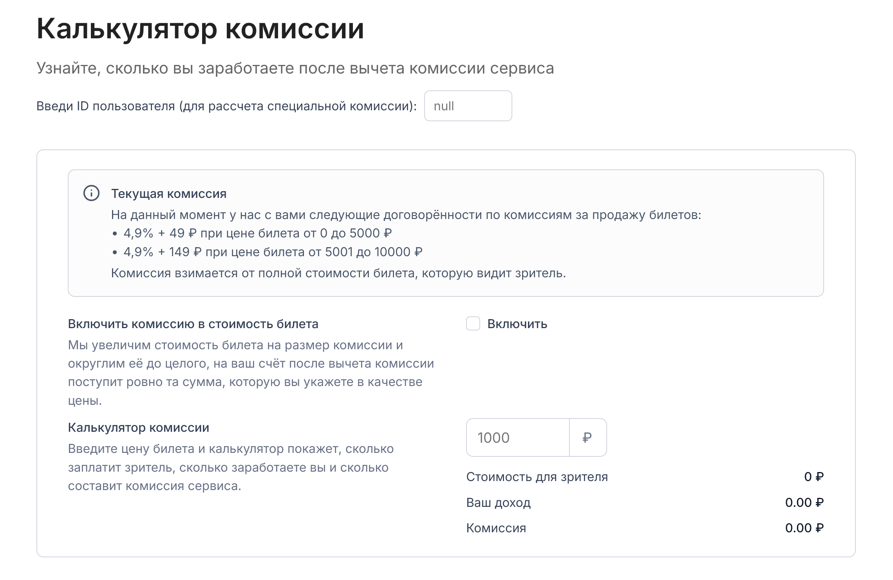

## Тестовое задание Fullstack (Frontend часть)


**Тестовое задание**  
Frontend с формой для расчета комиссии для билета — приложение с модульной архитектурой, написанное с использованием  React + Vite + Tanstack Query + Zod.

Включает в себя:
- Выбор пользователя — можно "притвориться" другим пользователем, влияющим на правила расчёта
- Zod-схемы для валидации входных и выходных данных
- Debounce на ввод цены билета
- Обработка статуса подгрузки данных, ошибок
- Управление пользовтелем через Context API

Использовалось: React, Vite, TypeScript, CSS по BEM, Tanstack Query

## Запуск проекта

1. Клонировать репозиторий

```
git clone https://github.com/ziaq/test-task-fee-calculator-react
```

2. Перейти в директорию проекта
```
cd test-task-fee-calculator-react
```

3. Установить зависимости

```
npm i
```

4. Создать `.env` файл в корне проекта, скопирвать туда:

```
VITE_API_URL=http://localhost:3001
```

5. Запустить проект

```
npm run dev
```

Приложенее будет доступно по адресу: [http://localhost:5171](http://localhost:5171 "http://localhost:5171")